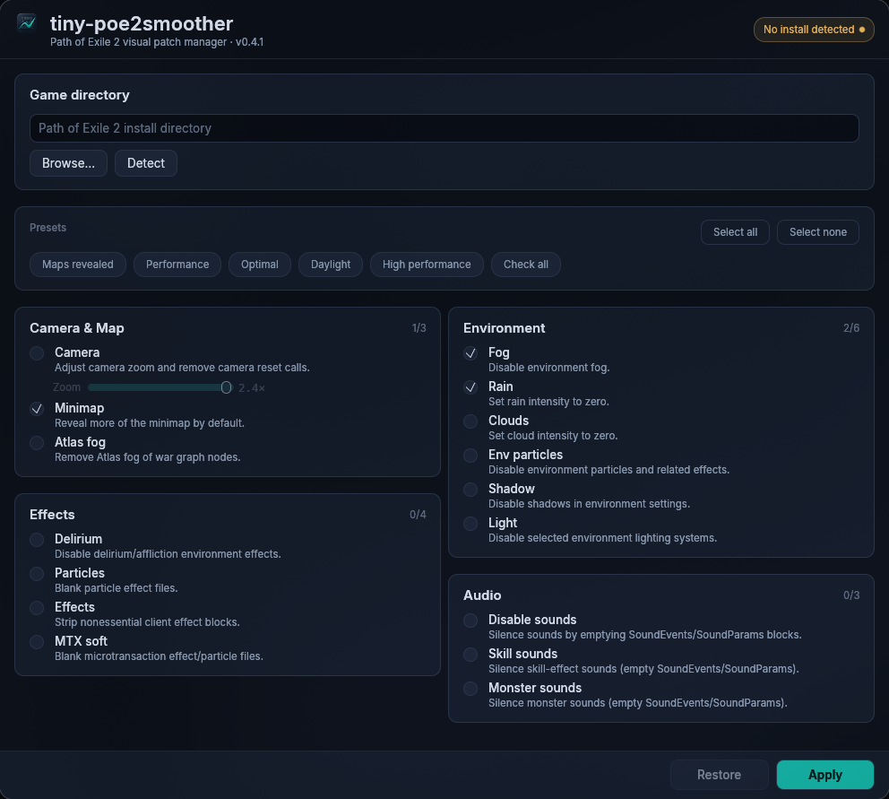

# tiny-poe2smoother

GUI tool that patches Path of Exile 2 bundle files to disable visual effects for improved performance.



## Features

- 18 optional patches: camera zoom, fog, rain, clouds, shadows, lighting, delirium effects, particles, minimap reveal, atlas fog, color mods, monster HP bars, environment particles, client effect blocks, plus sound silencing (disable sounds, skill sounds, monster sounds) and microtransaction effect removal (mtx-soft)
- Sound and MTX patches write ground-truth-derived, structurally valid bytes, so they never corrupt files or crash the game
- Camera zoom adjustment (1.2x -- 2.4x)
- Color mods: colorize modifier text wherever it appears in game — waystones, items, tablets — with a searchable editor over every stat in your own game files; per-mod color overrides and custom colors supported
- Monster HP bars: always show monster health bars instead of only after they take damage
- Safe modification via Oodle-compressed bundle patching with atomic writes
- Automatic Steam and standalone install detection, including secondary Steam library drives
- Saved GUI options between launches
- Backup and restore

## Download

Download the latest Windows executable or Linux archive from the [releases page](https://github.com/kengzzzz/tiny-poe2smoother/releases).

Windows:

- Run `poe2smoother-windows-x86_64.exe`.
- If Windows SmartScreen warns about an unknown app, choose "More info" then "Run anyway".

Linux:

- Extract `poe2smoother-linux-x86_64.tar.gz`.
- Run `./poe2smoother`.

## Usage

In the app:

1. Close Path of Exile 2.
2. Let the app detect the game folder, or choose it with Browse.
3. Select the patches you want.
4. Click Apply.
5. Use Restore before changing patch selection or before updating/verifying the game.

## Safety notes

- Apply is one-shot. Restore first before applying a different patch selection.
- Apply and restore are blocked while Path of Exile 2 is running.
- If the game crashes after using an older smoother release, verify Path of Exile 2 files in Steam or the standalone launcher before applying again.
- If a Path of Exile 2 update changes the bundle layout, the app may refuse to apply until tiny-poe2smoother is updated.

### Build from source

```sh
cargo build --release --bin tiny-poe2smoother
```

Use `cargo run --release` to launch the GUI directly from source.

Linux build requires GTK3, XCB, and Wayland development libraries for the GUI binary.

Cross-compilation for Windows and Linux via Docker is supported (see `Dockerfile`).

## Credits

The GUI embeds the [Inter](https://github.com/rsms/inter) typeface, licensed under the [SIL Open Font License 1.1](assets/fonts/OFL.txt).

Oodle-compatible compression/decompression comes from [Powzix's ooz](https://github.com/powzix/ooz) (GPL-3), vendored under `vendor/ooz/` and statically linked into release binaries — see `vendor/ooz/ATTRIBUTION`.

## How it works

The tool reads the game's Oodle-compressed bundle index (`Bundles2/_.index.bin`), locates shader, particle, and effect files within bundle data, applies targeted modifications (replacing UTF-16 LE values, zeroing particle files, stripping client blocks), and writes new compressed bundles atomically. Originals are backed up to `$XDG_DATA_HOME/tiny-poe2smoother/poe2.bak`.
